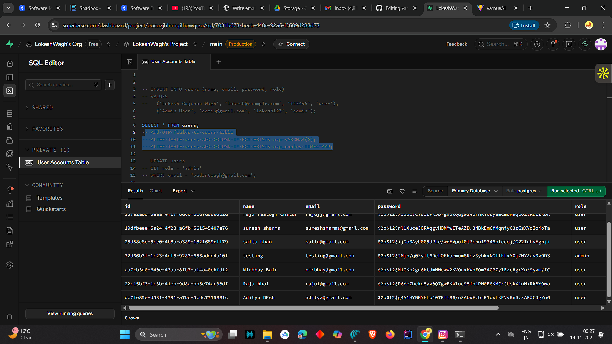
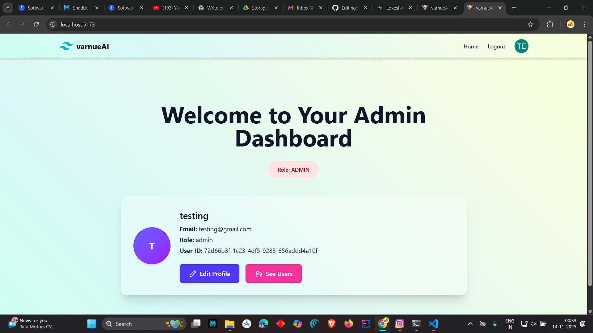
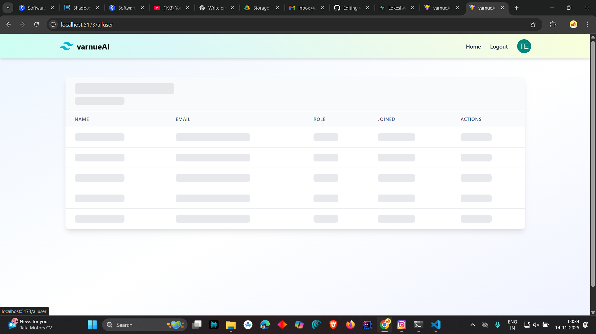
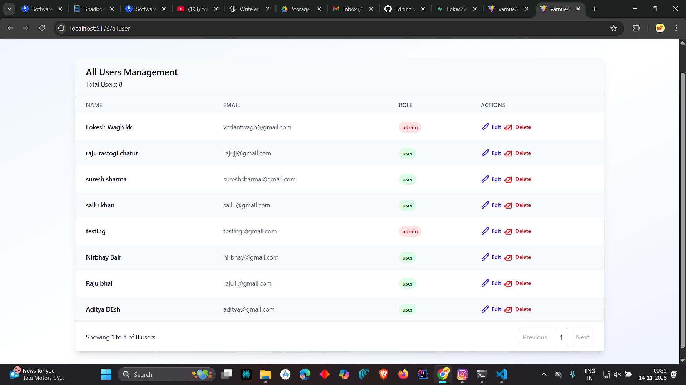
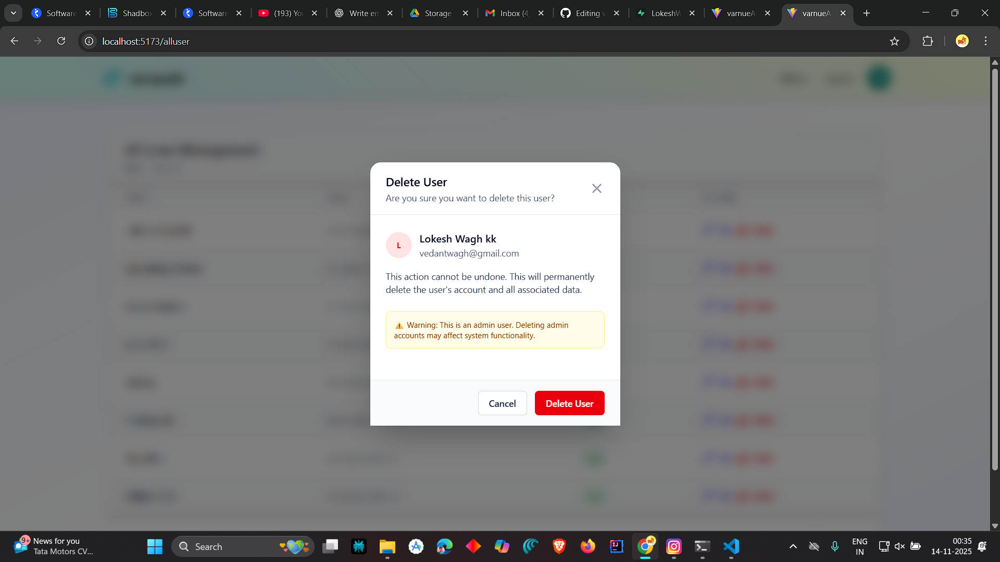
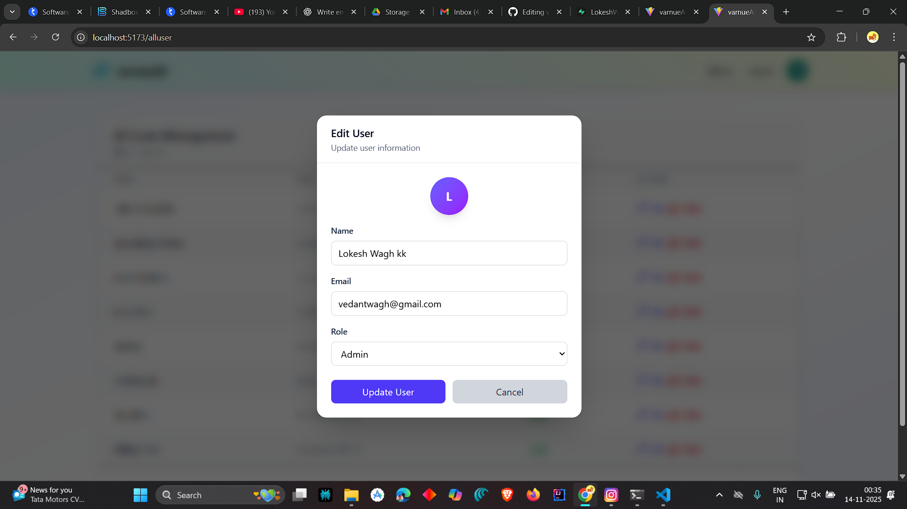
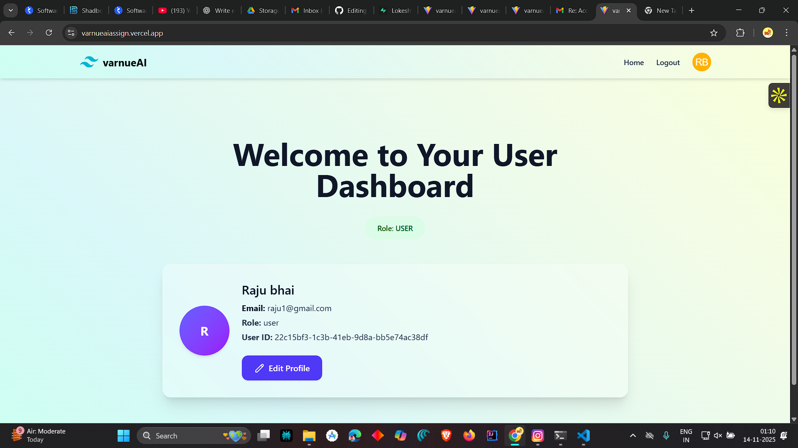

# 🌐 VarnueAI  Machine Coding round
Secure full-stack user management system with role-based authentication, JWT, password hashing, nodemailer for send reset email, admin panel, and a modern React UI.  
Built with **Node.js**, **Express**, **Supabase**, and **React (Vite + Tailwind CSS)**.

---
## Project Live Link : https://varnueaiassign.vercel.app/login
---
## Word Flow :
1) User Login :
   - Every user must log in using email and password.
   - After login, a JWT token is generated and user role is identified (admin or user).
   - Based on the role, the respective dashboard is opened.
2) User Dashboard (Role: User)
   - Users can view and update their own profile.
   - Users can reset their password using the “Forgot Password” process.
   - In the reset flow, an OTP is sent to the user's email via Nodemailer, and after OTP verification, the new password is saved (hashed using bcrypt).
3) Admin Dashboard (Role: Admin)
   - Admin can update their own profile.
   - Admin can view all registered users with pagination.
   - Admin can edit and Delete any user’s information from System also Paginate to Any page using the Pagination.
   - Admin can also reset their password using the same OTP-based flow.
4) Password Reset Process (Common for User & Admin)
   - User enters email → OTP is sent via Nodemailer.
   - User submits OTP → OTP is verified.
   - User sets a new password → password is hashed and updated.
5) Backend Workflow
   - All routes are protected using JWT middleware.
   - Role-based authorization ensures only admins can access admin-level routes.
   - All data is stored securely using Supabase.
6) Frontend Workflow
   - React + Vite handles UI rendering and routing.
   - Redux manages authentication state and user session.
   - API calls are made for Sign up, login, profile update, user management, and password reset.

## ✨ Features

- 🔐 User Authentication (JWT based)
- 👥 Role-Based Access (User/Admin)
- 🔑 Password Hashing (bcrypt)
- 🛠️ Admin Dashboard (User management)
- 🛠️ Pagination On UserList Admin
- ⚡ Fast React Vite frontend
- 🧵 Tailwind CSS styled UI
- 🗄️ Supabase as database
- 🚀 Fully API-driven architecture
- 🚀 Redux For State Management


---
# 🛠️ Installation & Setup

## 📌 1. Clone the Repository
```bash
Create New Folder and inside It Open Terminal
Below is command of Installation

git clone git@github.com:LokeshWagh/varnueAI.git
cd varnueAI
## Go to The Backend Folder
cd backend
 ### Installing backend dependencies
npm install
Paste the Env File In Backend Which i Provide In Email
npm start
```
Server Will run On :
 - http://localhost:4000
### 📌 2). Frontend Set Up (React + Tailwind )
```bash
#Got To Frontend
cd ../frontend
Install frontend dependencies:
npm install
##Start Development Server
npm run dev
```
frontend Is run on :
 - http://localhost:5173

### API EndPoints :: 

| Method | Endpoint            | Description                    |
| ------ | --------------------| ------------------------------ |
| POST   | /api/signup         | SignUp                         |
| POST   | /api/login          | Login (JWT) password Hashing   |
| PUT    | /profile/:id        | Update Employee Data           |
| POST   | /api/forgot-password| For Sending OTP                |
| POST   | api/reset-password  | Admin: Fetch all users         |
| GET    | /api/users          | Admin: Fetch all users         |
| DELETE | /api/users/:id      | Admin: Delete user             |

## Database Structure (Supabase)
This project uses Supabase as the backend database. A single table named users is used for storing all user account information.

The table includes the following fields:
  - id – Unique identifier (UUID)
  - name – Full name of the user
  - email – Email address (unique)
  - password – Hashed password stored using bcrypt
  - role – User role (admin or user)
  - otp – 6-digit OTP for password reset (optional, added during reset flow)
  - otp_expiry – Timestamp storing OTP expiry time
## ScrrenShot of Table :


---
# 📸 Project Screenshots
  - Login Page Also Forget Password page Which Similar to Sign up and Validate OTP
  
  --- 

 ---
 ### Forget PassWord

 ## After Login : 
  ### Admin Dashboard :



  ## Admin Access : All Users
   ### Loading Skeleton If All users 
     
 

 ### All User Interface With Delete and Edit and Pagination Functionality 
 
 
### Delete and Update Page Interfaces :
 
 --- 
 

 # User Dashboard :
  
  


 
